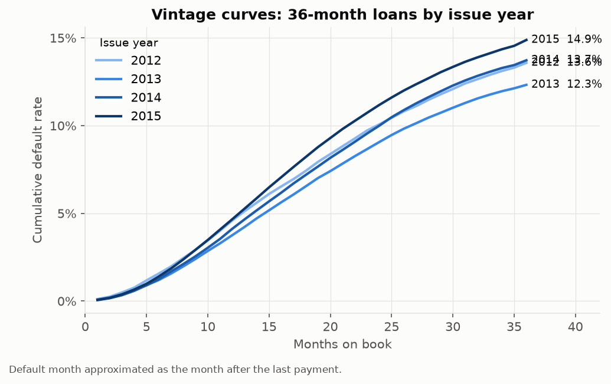
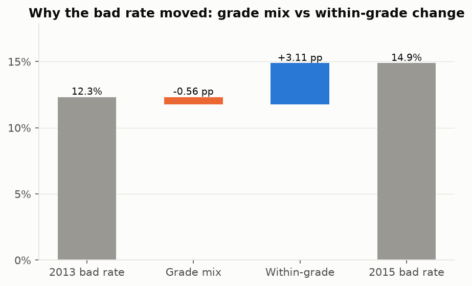
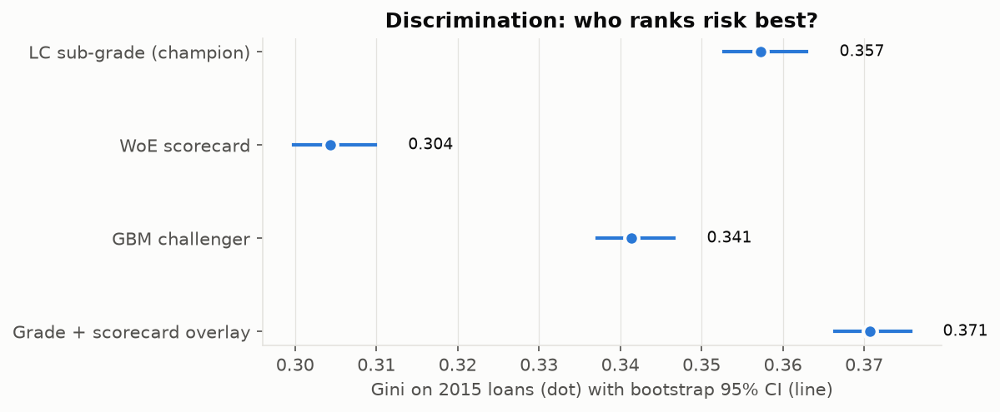
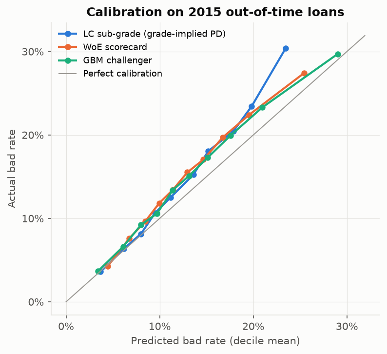
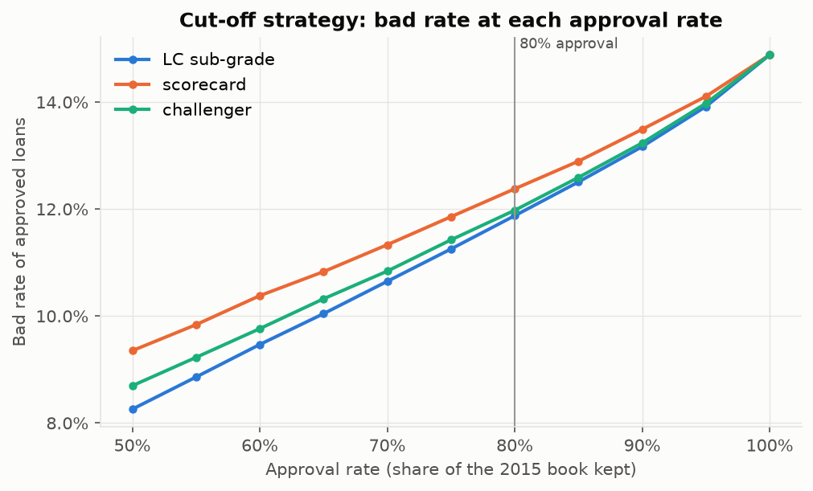
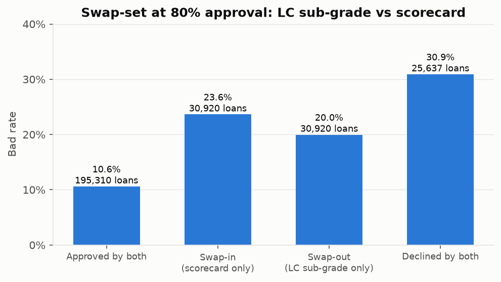

# Retail credit model review and underwriting strategy (LendingClub 2012-2015)

An end-to-end consumer-lending credit risk workflow on public loan-level data: SQL portfolio monitoring and root cause analysis, an application scorecard, a machine-learning challenger reviewed against the lender's own grade, underwriting cut-off and affordability tests, and a risk committee memo. Every number in the reports is generated by code from `outputs/results.json`.

## Results

| | |
|---|---|
| Loans (36-month, issued 2012-2015, final outcome) | 589,249 |
| Bad rate 2013 -> 2015 | 12.3% -> 14.9% (+2.56 pp) |
| ... from grade mix / within-grade | -0.56 pp / +3.11 pp |
| Out-of-time Gini: LC sub-grade / scorecard / GBM / overlay | 0.357 / 0.304 / 0.341 / 0.371 |
| Out-of-time KS: LC sub-grade / scorecard / GBM | 0.262 / 0.220 / 0.247 |
| Score PSI train vs 2015 (scorecard) | 0.001 |
| Model review verdict | Approve as an overlay, not a replacement |













## What is in here

| Stage | What it does | Where |
|---|---|---|
| 0 | Parse the raw file as text, cast explicitly, log every filter | `sql/00_parse_raw.sql`, `sql/01_build_loans.sql`, `outputs/tables/data_quality_funnel.csv` |
| 1 | Static-pool bad rates, months-on-book curves, quarterly health (CTEs, window functions) | `sql/02-04_*.sql` |
| 2 | Hand-written WoE binning, IV, correlation/VIF, logistic scorecard, points, Gini/KS/PSI/CSI, bootstrap CIs | `src/creditlab/woe.py`, `scorecard.py`, `metrics.py` |
| 3 | Champion (LC sub-grade) vs monotone GBM challenger vs overlay; permutation importance; model review | `models.py`, `reports/MODEL_REVIEW.md` |
| 4 | Swap-set analysis, cut-off strategy with realised return, pre/post-loan DTI caps inside score bands | `strategy.py` |
| 5 | Mix/rate decomposition, within-grade drill-down, early-warning by issue quarter | `rca.py` |
| 6 | Figures, risk committee memo, Tableau exports | `figures.py`, `report.py`, `reports/RISK_MEMO.md`, `docs/TABLEAU_GUIDE.md` |

## How to run

1. Download `accepted_2007_to_2018Q4.csv.gz` from Kaggle ("Lending Club Loan Data", wordsforthewise) into `data/raw/`.
2. Windows (PowerShell), from the repo folder:

```powershell
python -m pip install -r requirements.txt
python run_all.py
python -m pytest
```

`run_all.py` rebuilds everything from the raw file: tables, figures, reports and `outputs/results.json`.
The raw and processed data are not committed (see `.gitignore`).

## Design rules

- No leakage: model inputs are application-time fields only; a unit test fails if any post-origination
  field (payments, recoveries, last FICO, settlement fields) enters a feature list.
- LendingClub's grade, sub-grade, interest rate and instalment are its own model outputs and are used only as
  the benchmark.
- Out-of-time test: trained on 2012-2014, tested on 2015.
- Deterministic: seed 42 throughout.

## Limitations

Reject inference (only approved loans are observed); the sub-grade uses data not in this file; one benign
credit cycle; US market; realised return ignores fees, funding cost and time value. See `reports/MODEL_REVIEW.md`.
